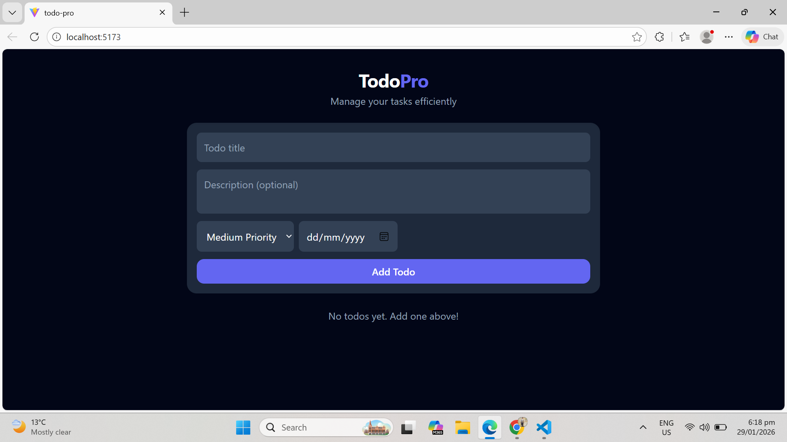
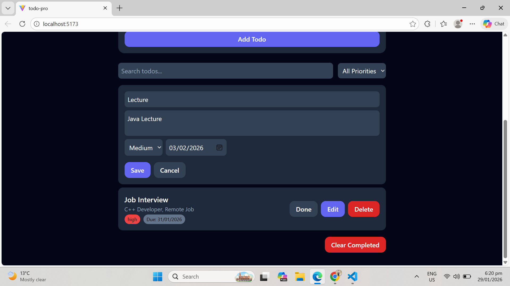
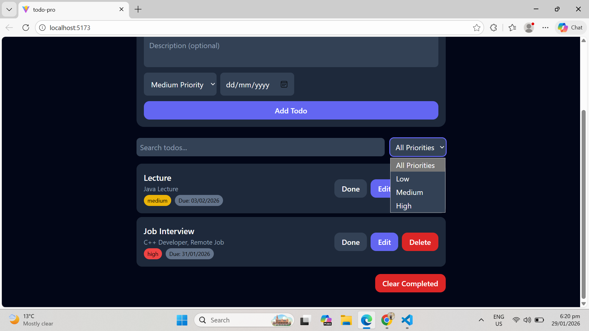
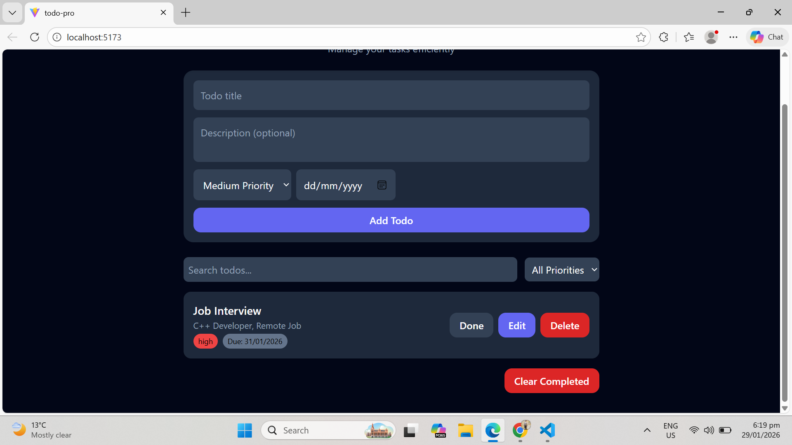

# **TodoPro – React TypeScript Todo App**

A professional **Todo App** built with **React, TypeScript, Tailwind CSS, and Vite**, featuring **Add, Edit, Delete, Mark Done, Search, Filter, Priority & Due Date** functionalities. Fully responsive and **LocalStorage-persisted**.

---

## **Live Demo**

_(Optional: Add your deployed app link here, e.g., Netlify / Vercel)_
[TodoPro Live](#)

---

## **Features**

- ✅ Add todos with **title, description, priority, and due date**
- ✏️ **Edit** existing todos inline
- ✔️ Mark todos as **completed / undo**
- ❌ Delete todos individually
- 🗑 Clear all **completed todos**
- 🔍 Search todos by **title**
- ⚡ Filter todos by **priority** or **completion status**
- ⏰ Overdue tasks highlighted in **red**
- Fully **responsive** with **Tailwind CSS**
- TypeScript-safe, fully typed
- LocalStorage persistence for data retention
- Premium, clean UI with hover & transition effects

---

## **Tech Stack**

- **React 18** – Functional Components & Hooks
- **TypeScript** – Type safety for scalable code
- **Tailwind CSS** – Fast, responsive, utility-first styling
- **Vite** – Fast build & development server
- **LocalStorage** – Data persistence

---

## **Folder Structure**

```
todo-pro/
├─ public/
│   └─ index.html
├─ src/
│   ├─ components/
│   │   ├─ todo/          # TodoList, TodoItem, TodoForm, FilterBar
│   │   ├─ ui/            # Reusable Button component
│   │   └─ layout/        # Header
│   ├─ context/           # TodoContext
│   ├─ hooks/             # Custom hooks
│   ├─ services/          # LocalStorage service
│   ├─ styles/            # Tailwind globals.css
│   ├─ types/             # Todo type definitions
│   ├─ App.tsx
│   └─ main.tsx
├─ package.json
├─ tsconfig.json
├─ tailwind.config.js
└─ vite.config.ts
```

---

## **Screenshots**

### **1. Todo List – Default View**



### **2. Add / Edit Todo Form**



### **3. Overdue & Priority Badges**



### **4. Search & Filter**



---

## **Getting Started**

### **1. Clone the repository**

git clone https://github.com/abbas679/todo-pro.git
cd todo-pro

```

### **2. Install dependencies**

npm install
```

### **3. Start development server**

npm run dev

```

### **4. Open in browser**

Visit `http://localhost:5173` (or the port displayed in terminal).

---

## **Build for Production**

npm run build
```

- Outputs optimized files in `dist/`
- Deploy to **Netlify, Vercel, or GitHub Pages**

---

## **Usage**

- **Add Task:** Fill form with title, description, priority & due date
- **Edit Task:** Click **Edit** next to task → Update fields → Save
- **Mark Done / Undo:** Toggle task completion
- **Delete Task:** Remove task permanently
- **Search & Filter:** Use search bar or filter by status/priority
- **Overdue Highlight:** Tasks past due date are red
- **Clear Completed:** Remove all completed tasks with a single click

---

## **Tailwind Preview**

<div class="flex flex-col sm:flex-row justify-between items-center p-4 bg-slate-800 rounded-xl shadow hover:scale-[1.01] transition-transform duration-200">
  <h3 class="font-semibold text-lg text-white">Task Title</h3>
  <span class="text-xs px-2 py-1 rounded-full bg-red-500 text-black">High</span>
  <span class="text-xs px-2 py-1 rounded-full bg-red-700 text-white">Due: 01/29/2026</span>
</div>
```

- Dark background, rounded cards
- Smooth hover effect
- Badges for **priority** and **due date**
- Fully mobile responsive

---

## **License**

MIT License – free to use, modify, and distribute.

---
